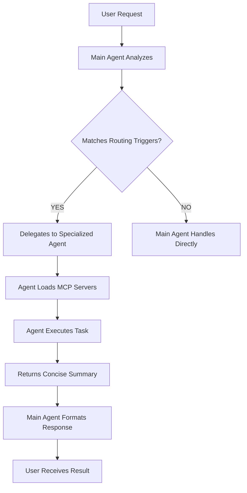

# Agent Reference Guide

## Overview

This document provides a comprehensive reference for all specialized agents available in your Claude Code configuration. These agents are designed to handle specific tasks with domain expertise and optimized MCP server access.

---

## 🎯 Core Principles

### MCP Delegation Model

- **Main Orchestrator**: Has ZERO MCP servers configured
- **Specialized Agents**: Load MCP servers only when invoked
- **Context Optimization**: 74% reduction in main agent context (125k → 33k tokens)
- **Isolation**: Each agent gets only the MCP servers it needs

### When to Delegate

Delegate to specialized agents when tasks involve:
- **External Services**: Database, browser automation, web scraping
- **Library Documentation**: Looking up API references and code examples
- **Domain Expertise**: Testing, deployment, security, performance
- **MCP Operations**: Any task requiring MCP server access

---

## 📚 Available Agents

### Development Agents

#### `backend-architect`
**Purpose**: Backend architecture and API design
**MCP Servers**: `supabase`
**Best For**:
- Database schema design and migrations
- RPC function development
- RLS policy implementation
- API endpoint design
- Data model optimization

**Routing Triggers**: `database`, `migration`, `supabase`, `schema`, `RPC`, `SQL query`, `RLS policy`, `backend design`, `API handler`

**Example Usage**:
```
User: "Create a migration for user_preferences table with RLS"
→ Delegates to: backend-architect
→ Returns: Migration file path, schema summary, RLS policies
```

---

#### `frontend-developer`
**Purpose**: React and UI development
**MCP Servers**: None (relies on built-in tools)
**Best For**:
- React component development
- Hooks and state management
- Zustand stores
- UI/UX implementation
- Responsive design

**File Patterns**: `**/*.tsx`, `src/components/**/*.ts`, `src/stores/**/*.ts`

**Example Usage**:
```
User: "Create a dashboard component with data visualization"
→ Delegates to: frontend-developer
→ Returns: Component files, hooks, styling
```

---

#### `typescript-pro`
**Purpose**: TypeScript expertise and type safety
**MCP Servers**: None
**Best For**:
- Advanced type definitions
- Generics and utility types
- Type errors and inference issues
- API contracts (Zod schemas)
- Complex type-level programming

**File Patterns**: `src/lib/api/contracts.ts`, `**/*.d.ts`, config files

**Example Usage**:
```
User: "Fix type errors in API contracts"
→ Delegates to: typescript-pro
→ Returns: Fixed type definitions with explanations
```

---

### Quality Assurance Agents

#### `code-reviewer-pro`
**Purpose**: Comprehensive code quality review
**MCP Servers**: None
**Best For**:
- Security audits
- Best practices enforcement
- Maintainability analysis
- Performance optimization
- Architecture consistency

**Triggers**: All Edit/Write operations (via hooks)

**Example Usage**:
```
User: [Edits src/handlers/auth.ts]
→ Auto-triggers: code-reviewer-pro (via hook)
→ Returns: Security issues, suggestions, approval/rejection
```

---

#### `test-automator`
**Purpose**: Test generation and automation
**MCP Servers**: `chrome-devtools`, `playwright`
**Best For**:
- Unit test generation
- Integration testing
- Test debugging
- CI/CD test automation
- Test coverage improvement

**Routing Triggers**: `test automation`, `playwright`, `fix test`, `test coverage`, `test debugging`

**Example Usage**:
```
User: "Create tests for the login API handler"
→ Delegates to: test-automator
→ Returns: Test files with coverage report
```

---

#### `qa-expert`
**Purpose**: E2E testing and QA validation
**MCP Servers**: `chrome-devtools`, `playwright`
**Best For**:
- End-to-end user flows
- Visual testing and screenshots
- Browser automation
- Performance profiling
- Pre-deployment validation

**Routing Triggers**: `E2E test`, `browser test`, `visual test`, `screenshot`, `performance trace`

**Example Usage**:
```
User: "Run E2E tests for the checkout flow"
→ Delegates to: qa-expert
→ Returns: Test results, screenshots, failure analysis
```

---

### Infrastructure Agents

#### `deployment-engineer`
**Purpose**: CI/CD and deployment automation
**MCP Servers**: None (uses GitHub CLI, Docker, etc.)
**Best For**:
- GitHub Actions workflows
- Deployment scripts
- Docker configuration
- Environment management
- Production monitoring

**Routing Triggers**: `CI/CD`, `deploy`, `GitHub Actions`, `docker`, `production`

**Example Usage**:
```
User: "Set up CI/CD pipeline for staging environment"
→ Delegates to: deployment-engineer
→ Returns: Workflow files, deployment scripts
```

---

#### `database-optimizer`
**Purpose**: Database performance tuning
**MCP Servers**: `supabase`
**Best For**:
- Query optimization
- Index creation and tuning
- Performance analysis
- Query plan review
- Database profiling

**Routing Triggers**: `optimize query`, `slow query`, `database performance`, `index`, `query plan`

**Example Usage**:
```
User: "Optimize the slow campaign listing query"
→ Delegates to: database-optimizer
→ Returns: Optimized query, indexes, performance metrics
```

---

### Research & Documentation Agents

#### `documentation-expert`
**Purpose**: Library documentation and API references
**MCP Servers**: `Context7`
**Best For**:
- Library documentation lookup
- API reference searches
- Code examples
- Framework guides
- Package documentation

**Routing Triggers**: `library docs`, `API reference`, `how to use`, `package documentation`, `framework guide`

**Example Usage**:
```
User: "How do I use Supabase RLS policies?"
→ Delegates to: documentation-expert
→ Returns: Documentation summary, code examples, reference URLs
```

---

#### `general-purpose`
**Purpose**: Web scraping and research
**MCP Servers**: `firecrawl-mcp`, `Context7`
**Best For**:
- Web content extraction
- Competitor research
- URL crawling
- Data gathering
- Fallback for unknown MCP tasks

**Routing Triggers**: `scrape`, `crawl`, `extract from web`, `fetch URL`, `web content`, `research`

**Example Usage**:
```
User: "Scrape competitor pricing from their website"
→ Delegates to: general-purpose
→ Returns: Extracted data, structured format
```

---

### Project Management Agents

#### `product-manager`
**Purpose**: Task and project management
**MCP Servers**: `clickup`
**Best For**:
- ClickUp task creation
- Sprint planning
- Roadmap management
- Milestone tracking
- Project coordination

**Routing Triggers**: `clickup`, `create task`, `project plan`, `roadmap`, `sprint planning`

**Example Usage**:
```
User: "Create tasks for the Q2 roadmap"
→ Delegates to: product-manager
→ Returns: Created tasks with IDs and links
```

---

### Data Engineering Agents

#### `data-engineer`
**Purpose**: Data pipelines and ETL operations
**MCP Servers**: `supabase`
**Best For**:
- ETL pipeline design
- Data transformation
- Batch processing
- Data migration
- Data quality checks

**Routing Triggers**: `data pipeline`, `ETL`, `data transformation`, `batch process`, `data migration`

**Example Usage**:
```
User: "Create ETL pipeline for ad metrics"
→ Delegates to: data-engineer
→ Returns: Pipeline scripts, transformation logic, schedule
```

---

### Debugging Agent

#### `debugger`
**Purpose**: Issue resolution and debugging
**MCP Servers**: None
**Best For**:
- Root cause analysis
- Test failure investigation
- Error handling
- Stack trace analysis
- Unexpected behavior

**Routing Triggers**: `debug`, `fix bug`, `test failure`, `error`, `investigate`

**Example Usage**:
```
User: "Why is my API returning 500 errors?"
→ Delegates to: debugger
→ Returns: Root cause, fix suggestions, error handling improvements
```

---

## 🔄 Agent Delegation Workflow

### Automatic Routing

The system uses keyword matching to automatically route requests:



### Manual Delegation

You can explicitly request specific agents:

```
User: "@backend-architect create a migration for..."
User: "Use the qa-expert to test..."
User: "Have the code-reviewer-pro check this..."
```

---

## 📊 Response Formats

### Standard Response Structure

All agents return responses with:

```json
{
  "summary": "Concise task summary",
  "files_changed": ["file:line references"],
  "artifacts": ["created files, screenshots, etc."],
  "next_steps": ["suggested follow-up actions"],
  "issues": ["warnings or blockers"],
  "references": ["documentation URLs"]
}
```

### Context Optimization

- **Max Response Size**: 500-800 tokens per agent
- **File References**: Use `file:line` format, not full content
- **Summaries Only**: Exclude verbose dumps and raw data
- **Action-Oriented**: Focus on what changed, not implementation details

---

## 🎯 Quality Gates

### Pre-Commit Gate

**Required Agents**: `code-reviewer-pro`
**Optional**: `typescript-pro`, `test-automator`
**Minimum Score**: 80/100
**Blocking**: Yes

### Pre-Deployment Gate

**Required Agents**: `qa-expert`, `code-reviewer-pro`
**Optional**: `test-automator`
**Minimum Score**: 85/100
**Blocking**: Yes

---

## ⚙️ Configuration Files

### Project-Level Config

- **Location**: `.claude/agents/`
- **Files**:
  - `delegation-map.json` - Agent routing rules
  - `mcp-mapping.json` - MCP server configurations
  - `configs/*.json` - Individual agent configs
  - `quality-judge.md` - Quality gate definitions

### Global Config

- **Location**: `~/.claude/agents/shared/`
- **Purpose**: Shared agents across all projects
- **Setup**: Enable during `setup.sh` installation

---

## 🚀 Quick Reference

### Common Commands

```bash
# View agent delegation map
cat .claude/agents/delegation-map.json | jq '.agent_capabilities'

# List available agents
ls .claude/agents/configs/

# Test agent delegation
# (Mention keywords in your prompts to trigger automatic routing)
```

### Integration with Setup Script

The `setup.sh` script:
1. Copies agent configs to `.claude/agents/`
2. Replaces placeholders (PKG_MANAGER, PROJECT_NAME, FRAMEWORK)
3. Optionally links to global shared agents (`~/.claude/agents/shared/`)
4. Sets up hooks that trigger agents on Edit/Write/Commit

---

## ⚠️ Best Practices

### DO ✅

- Delegate all MCP operations to specialized agents
- Use keyword matching for automatic routing
- Return summaries with file:line references
- Run browser automation with `--isolated` flag
- Use parallel delegation for independent tasks
- Keep agent responses under 800 tokens

### DON'T ❌

- Call MCP tools directly from main agent
- Load all MCP servers "just in case"
- Return full MCP responses (bloats context)
- Skip delegation for "simple" MCP tasks
- Modify main agent config to add MCP servers

---

## 📚 Related Documentation

- **Setup Guide**: `../README.md`
- **MCP Delegation**: `./MCP_DELEGATION_GUIDE.md`
- **Hooks Reference**: `../hooks/README.md`
- **Commands**: `../commands/*.md`

---

## 🔒 Security Notes

- Agent configs may contain API tokens (gitignored)
- Use environment variables for sensitive data
- Follow principle of least privilege
- Review agent permissions before deployment
- Never commit `.claude/agents/configs/*.json` to version control

---

*Last Updated: 2025-10-08*
