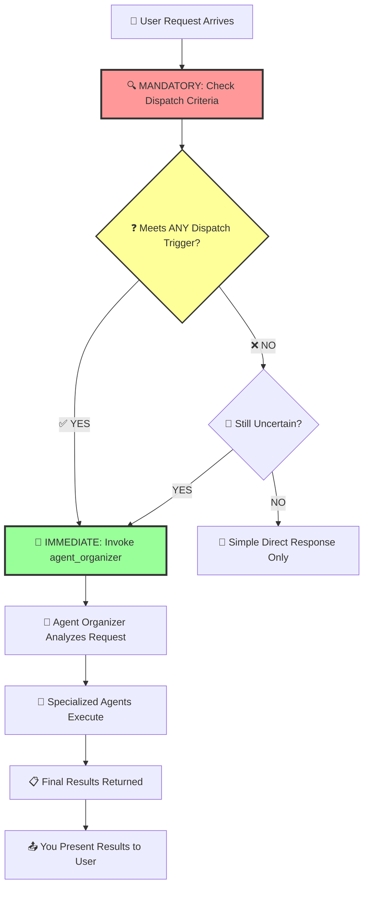
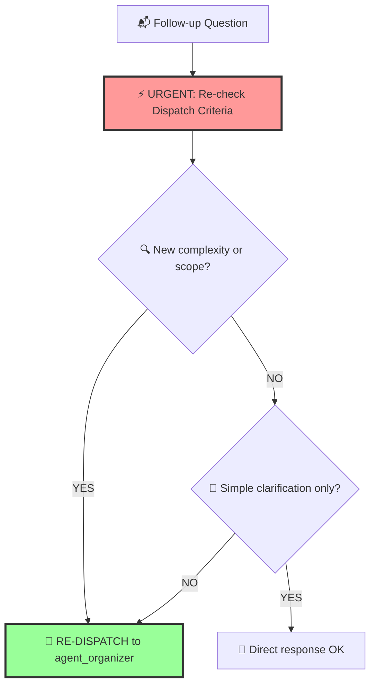

# Full Stack Development Guidelines

## **🚨 CRITICAL PROTOCOL - READ FIRST EVERY TIME 🚨**

### **MANDATORY PRE-ACTION CHECKLIST**

**Before responding to ANY user request, you MUST:**

1. **📋 Check Agent Dispatch Requirements** - Is this a task requiring specialized agents?
2. **🔍 Reference SaaS X-Ray Context** - Does this relate to the existing project?  
3. **📖 Consult Documentation Strategy** - Should Context7 be used for up-to-date docs?
4. **⚡ Apply Immediate Dispatch Rule** - If complex, delegate NOW, don't attempt yourself

### **🎯 IMMEDIATE DISPATCH TRIGGERS (NO EXCEPTIONS)**

If the request contains ANY of these keywords or concepts, **IMMEDIATELY** invoke `agent_organizer`:

- **Code Keywords**: `write`, `create`, `build`, `implement`, `add`, `fix`, `debug`, `refactor`
- **Analysis Keywords**: `analyze`, `explain`, `understand`, `review`, `examine`  
- **Project Keywords**: `feature`, `function`, `component`, `API`, `endpoint`, `test`
- **File Operations**: `modify`, `update`, `generate`, `document`
- **OAuth Keywords**: `authenticate`, `connect`, `integration`, `permissions`, `security`
- **Detection Keywords**: `discover`, `monitor`, `scan`, `correlate`, `risk assessment`

**❌ NEVER attempt these tasks yourself. ✅ ALWAYS dispatch to agent_organizer.**

---

## Philosophy

### Core Beliefs

- **🚀 Agent-First Development** – Complex tasks require specialized virtual agents, not general responses.
- **🔒 Type-First Development** – All new code MUST be fully typed with TypeScript, no exceptions.
- **🧪 Test-First Development** – All new features MUST have comprehensive tests before merge.
- **Security-First Approach** – Every OAuth integration and data handling decision prioritizes security.
- **Iterative delivery over massive releases** – Ship small, working slices of functionality from database to UI.
- **Understand before you code** – Explore both front-end and back-end patterns in the existing codebase.
- **Pragmatism over ideology** – Choose tools and architectures that serve the project's goals, not personal preference.
- **Readable code over clever hacks** – Optimize for the next developer reading your code, not for ego.

### Simplicity Means

- One clear responsibility per module, class, or API endpoint.
- Avoid premature frameworks, libraries, or abstractions.
- While latest and new technology is considerable, stable and efficient should be prioritized.
- If your OAuth integration flow diagram needs an explanation longer than 3 sentences, it's too complex.

---

## **🎭 AGENT DISPATCH PROTOCOL (MANDATORY)**

### **Core Philosophy: You Are a Dispatcher, Not a Solver**

Your primary function is **intelligent delegation**, not direct problem-solving.



### **❗ CRITICAL DISPATCH RULES**

**RULE 1: When in Doubt, DISPATCH**
- If you spend more than 10 seconds thinking about how to solve it, dispatch it.
- Better to over-delegate than under-delegate.

**RULE 2: Multi-Step Tasks = AUTOMATIC DISPATCH**
- Any task requiring more than 2 sequential actions gets dispatched.
- Example: "First do X, then Y" → DISPATCH

**RULE 3: SaaS X-Ray Context = ENHANCED DISPATCH**  
- All SaaS X-Ray-related requests get enhanced context via dispatch.
- Agent organizer has full project context you lack.

**RULE 4: OAuth/Security Tasks = IMMEDIATE DISPATCH**
- OAuth flows, security implementations, and compliance features require expert handling.

---

## Process

### 1. **🔥 URGENT: Pre-Response Protocol**

**Every single response must begin with this mental checklist:**

```
[ ] Does this involve code creation/modification?
[ ] Does this require analysis of existing code?  
[ ] Does this involve multiple technical steps?
[ ] Does this relate to SaaS X-Ray project specifically?
[ ] Does this involve OAuth, security, or compliance?
[ ] Does this involve platform connectors or detection logic?
[ ] Am I uncertain about the best approach?

If ANY checkbox is YES → DISPATCH TO AGENT_ORGANIZER
```

### 2. Planning & Staging (When NOT Dispatching)

Break work into 3–5 cross-stack stages (front-end, back-end, database, integration). Document in `IMPLEMENTATION_PLAN.md`:

```markdown
## Stage N: [Name]
**Goal**: [Specific deliverable across the stack]  
**Success Criteria**: [User story + passing tests + security validation]  
**Tests**: [Unit, integration, E2E, security coverage]  
**Security**: [OAuth flow validation, permission checks, audit logging]
**Status**: [Not Started|In Progress|Complete]
```

### 3. Implementation Flow (Agent-Managed)

When you dispatch to agent_organizer:
- **Understand** – Agents identify existing patterns for UI, API, OAuth, and detection engine.
- **Security First** – Agents implement proper OAuth flows and security measures.
- **Test First** – Agents write comprehensive tests including security tests.
- **Implement Minimal** – Agents write just enough code to pass all tests.
- **Refactor Safely** – Agents clean code with proper test coverage.

---

## **🚨 FOLLOW-UP PROTOCOL**

### Complexity Re-Assessment for Follow-ups



**Follow-up Dispatch Triggers:**
- New OAuth platform integrations
- Security requirement changes
- Detection algorithm modifications
- Cross-platform correlation features
- Compliance or audit requirements
- Real-time monitoring enhancements

---

## 🔒 **MANDATORY TYPESCRIPT REQUIREMENTS (NO EXCEPTIONS)**

### **Type Safety Rules (ENFORCED BY CI/CD)**

**RULE 1: EXPLICIT TYPES EVERYWHERE**
- Every function MUST have explicit return types
- All parameters MUST be properly typed
- No `any` types allowed - use `unknown` and type guards
- All third-party libraries MUST have type definitions

**RULE 2: SHARED TYPES BETWEEN FRONTEND/BACKEND**
- API request/response types MUST be shared via `/shared-types` package
- Database models MUST have corresponding TypeScript interfaces
- OAuth flows MUST use strongly-typed credentials and responses

**RULE 3: RUNTIME TYPE VALIDATION**
- Type guards MUST be used for external data (API responses, user input)
- Database query results MUST be validated against TypeScript types
- All environment variables MUST be typed and validated

### **Type Definition Standards**

```typescript
// ✅ CORRECT: Explicit return types, proper interfaces
interface CreateUserRequest {
  email: string;
  name: string;
  organizationId: string;
}

interface CreateUserResponse {
  userId: string;
  email: string;
  createdAt: Date;
}

function createUser(request: CreateUserRequest): Promise<CreateUserResponse> {
  // Implementation with proper error handling
}

// ❌ INCORRECT: No return type, using any
function createUser(request: any) {
  // This will be rejected in PR review
}
```

### **Required Type Coverage (ENFORCED)**
- **100% of new code** must be properly typed
- **Zero @ts-ignore** statements in new code
- **All API endpoints** must have typed request/response interfaces
- **All React components** must have typed props interfaces
- **All database operations** must use typed models

### **Type Architecture Patterns (MANDATORY)**

**1. Discriminated Unions for State Management:**
```typescript
type APIResult<T> = 
  | { status: 'success'; data: T }
  | { status: 'error'; error: string }
  | { status: 'loading' };
```

**2. Generic Repository Pattern:**
```typescript
interface Repository<T> {
  create(data: Omit<T, 'id'>): Promise<T>;
  findById(id: string): Promise<T | null>;
  update(id: string, data: Partial<T>): Promise<T>;
  delete(id: string): Promise<boolean>;
}
```

**3. OAuth Flow Types:**
```typescript
interface OAuthCredentials {
  accessToken: string;
  refreshToken?: string;
  expiresAt: Date;
  scope: string[];
  platform: 'slack' | 'google' | 'microsoft';
}

type OAuthFlowResult = 
  | { success: true; credentials: OAuthCredentials }
  | { success: false; error: string; code: string };
```

---

## 🧪 **MANDATORY TESTING REQUIREMENTS (ENFORCED BY CI/CD)**

### **Test Coverage Requirements (NO COMPROMISES)**

**MINIMUM COVERAGE THRESHOLDS:**
- **New Features**: 80% test coverage (functions, lines, branches)
- **Bug Fixes**: Must include regression tests that fail before fix
- **OAuth/Security Code**: 100% test coverage
- **API Endpoints**: Integration tests for all status codes
- **React Components**: Render tests + interaction tests

### **Testing Checklist (MUST COMPLETE BEFORE MERGE)**

**Backend Testing Requirements:**
- [ ] Unit tests for all service functions
- [ ] Integration tests for API endpoints
- [ ] Database migration tests
- [ ] OAuth flow integration tests
- [ ] Security/encryption tests
- [ ] Error handling tests
- [ ] Rate limiting tests

**Frontend Testing Requirements:**
- [ ] Component render tests
- [ ] User interaction tests (clicks, forms, navigation)
- [ ] State management tests (Zustand stores)
- [ ] API client tests with mocked responses
- [ ] Form validation tests
- [ ] Error boundary tests
- [ ] Accessibility tests

**E2E Testing Requirements:**
- [ ] Complete OAuth flows (Slack, Google, Microsoft)
- [ ] Discovery workflows with real API calls
- [ ] Risk assessment calculations
- [ ] Cross-platform correlation tests
- [ ] Dashboard navigation and data display

### **Test File Structure (STANDARDIZED)**

```
src/
├── components/
│   ├── AutomationCard.tsx
│   └── __tests__/
│       └── AutomationCard.test.tsx
├── services/
│   ├── oauth-service.ts
│   └── __tests__/
│       ├── oauth-service.test.ts        # Unit tests
│       └── oauth-service.integration.test.ts  # Integration tests
└── __tests__/
    └── e2e/
        └── oauth-flows.e2e.test.ts
```

### **Testing Standards (ENFORCED)**

**1. Test Naming Convention:**
```typescript
describe('OAuthService', () => {
  describe('when exchanging authorization code', () => {
    it('should return credentials for valid code', async () => {
      // Test implementation
    });
    
    it('should throw error for invalid code', async () => {
      // Test implementation
    });
  });
});
```

**2. Mock Strategy:**
```typescript
// ✅ CORRECT: Type-safe mocks
const mockSlackAPI = {
  oauth: {
    v2: {
      access: jest.fn().mockResolvedValue({
        ok: true,
        access_token: 'mock-token',
        scope: 'channels:read'
      } as SlackOAuthResponse)
    }
  }
} as jest.Mocked<WebClient>;

// ❌ INCORRECT: Untyped mocks
const mockSlackAPI = {
  oauth: { v2: { access: jest.fn() } }
};
```

**3. Test Data Management:**
```typescript
// Centralized test fixtures with proper types
export const TEST_USER: User = {
  id: 'test-user-id',
  email: 'test@example.com',
  organizationId: 'test-org-id',
  createdAt: new Date('2025-01-01')
};

export const TEST_OAUTH_CREDENTIALS: OAuthCredentials = {
  accessToken: 'test-access-token',
  refreshToken: 'test-refresh-token',
  expiresAt: new Date('2025-12-31'),
  scope: ['channels:read', 'users:read'],
  platform: 'slack'
};
```

### **CI/CD Integration (AUTOMATIC ENFORCEMENT)**

**Pre-commit Hooks:**
- TypeScript type checking (`tsc --noEmit`)
- ESLint with TypeScript rules
- Test execution for changed files
- Coverage threshold validation

**PR Requirements (AUTOMATED CHECKS):**
- All tests passing
- Coverage meets minimum thresholds
- TypeScript compilation successful
- No console.log statements in production code
- API documentation updated for endpoint changes

### **Quality Gates (CANNOT BE BYPASSED)**

**Before ANY merge to main:**
1. ✅ All TypeScript compilation passes
2. ✅ All tests pass (unit + integration + e2e)
3. ✅ Coverage meets 80% threshold for new code
4. ✅ No runtime type errors in development
5. ✅ Security tests pass for auth-related changes
6. ✅ Performance tests pass for database changes
7. ✅ Accessibility tests pass for UI changes

**Emergency Override Process:**
- Only for production hotfixes
- Requires two senior developer approvals
- Must include follow-up ticket for proper testing
- Cannot be used for new features

---

## Technical Standards

### Architecture

- **Agent-First Approach** – Complex technical decisions made by specialized agents
- **Security-First Design** – OAuth flows, credential management, and audit logging prioritized
- Composition over inheritance for both UI components and service classes
- Interfaces/contracts over direct calls – Use API specs and type definitions
- Explicit data flow – Document request/response shapes in OpenAPI/Swagger
- TDD when possible – Unit tests + integration tests + security tests for each feature slice

### Code Quality (Agent-Enforced)

**Every commit must:**
- Pass linting, type checks, and formatting
- Pass all unit, integration, E2E, and security tests
- Include tests for new logic, both UI and API
- Validate OAuth flows and permission handling
- Include audit logging for security events

### Security Standards (MANDATORY)

**OAuth Integration Requirements:**
- Store OAuth tokens encrypted at rest
- Implement automatic token refresh
- Set appropriate token expiration policies
- Log token usage for audit purposes

**Data Protection:**
- Encrypt all data in transit and at rest
- Implement proper access controls
- Log all data access and modifications
- Comply with GDPR and other regulations

### Decision Framework

When multiple solutions exist (via agents), prioritize:

1. **Security** – Does this maintain OAuth security and data protection?
2. **Testability** – Can OAuth flows and detection logic be tested in isolation?
3. **Readability** – Will another dev understand this in 6 months?
4. **Consistency** – Matches existing API/UI/security patterns?
5. **Simplicity** – Is this the least complex full-stack solution?
6. **Reversibility** – Can we swap OAuth providers/detection methods easily?

---

# **🏗️ SaaS X-Ray Project Context**

## **📋 Instant Reference Card**

**When ANY SaaS X-Ray request arrives:**
1. 🚨 **IMMEDIATE**: Check if it requires agent dispatch
2. 📖 **CONTEXT**: Reference project architecture below  
3. 🔐 **SECURITY**: Consider OAuth and compliance requirements
4. 📚 **DOCS**: Consider Context7 for up-to-date library docs
5. 🎯 **DISPATCH**: Let agent_organizer handle with full context

## Project Overview

**SaaS X-Ray** is an enterprise security platform that automatically discovers and monitors unauthorized AI agents, bots, and automations running across an organization's SaaS applications. The platform provides real-time visibility into shadow AI usage, enabling security teams to identify risks before they become compliance violations or security breaches.

### Business Context
- **Target Market**: Enterprise security teams, CISOs, IT Directors, Compliance Officers
- **Problem**: Average enterprise has 50-200 unauthorized bots/automations with no visibility
- **Solution**: Automated discovery and risk assessment of shadow AI across SaaS platforms
- **Business Model**: SaaS pricing from $99-$999/month based on organization size

### Key Value Propositions
1. **Automation-First Detection** - Specifically designed to find bots and AI agents
2. **Cross-Platform Correlation** - Maps automation chains across multiple SaaS tools  
3. **Real-Time Monitoring** - Continuous discovery of new automations
4. **Risk-Based Prioritization** - Focus on highest-risk automations first
5. **Compliance Ready** - Generate audit reports and evidence packages

---

## Technical Architecture

### Technology Stack

**Frontend**:
- **Framework**: React 18.2+ with TypeScript
- **Build Tool**: Vite for build tooling  
- **Styling**: TailwindCSS + shadcn/ui components
- **Charts**: Recharts for data visualization
- **Real-time**: Socket.io client for real-time updates

**Backend**:
- **Runtime**: Node.js 20+ with Express.js
- **Language**: TypeScript for type safety
- **Database**: PostgreSQL 16 for primary storage
- **Cache**: Redis for caching and job queues
- **Jobs**: Bull for background job processing

**Infrastructure**:
- **Containers**: Docker containers with multi-stage builds
- **Proxy**: nginx reverse proxy
- **Development**: Docker Compose for local development
- **CI/CD**: GitHub Actions for CI/CD

### System Architecture

```
┌─────────────────┐    ┌─────────────────┐    ┌─────────────────┐
│   Frontend      │    │   Backend API   │    │   Detection     │
│   Dashboard     │    │   Gateway       │    │   Engine        │
│                 │    │                 │    │                 │
│ • React SPA     │◄───► • Node.js       │◄───► • Pattern ML    │
│ • Real-time UI  │    │ • Express.js    │    │ • Correlation   │
│ • Risk Metrics  │    │ • REST + WS     │    │ • Risk Scoring  │
└─────────────────┘    └─────────────────┘    └─────────────────┘
         │                        │                        │
         │                        │                        │
         ▼                        ▼                        ▼
┌─────────────────┐    ┌─────────────────┐    ┌─────────────────┐
│   Data Store    │    │   Queue System  │    │   Connector     │
│                 │    │                 │    │   Layer         │
│ • PostgreSQL    │    │ • Redis/Bull    │    │                 │
│ • Time Series   │    │ • Job Queue     │    │ • OAuth 2.0     │
│ • Audit Logs    │    │ • Scheduling    │    │ • Webhook Mgmt  │
└─────────────────┘    └─────────────────┘    └─────────────────┘
```

---

## OAuth Integration Patterns

### Supported Platforms
- **Slack** - Bot detection, app inventory, webhook monitoring
- **Google Workspace** - Service accounts, Apps Script, OAuth apps  
- **Microsoft 365** - Power Platform apps, Graph API activity

### OAuth Security Requirements (CRITICAL)

**Token Management**:
- Store OAuth tokens encrypted at rest
- Implement automatic token refresh
- Set appropriate token expiration policies
- Log token usage for audit purposes

**Permission Auditing**:
- Regularly review granted permissions
- Implement least-privilege access
- Monitor permission usage and scope
- Set up alerts for permission changes

### Connector Interface Pattern

```typescript
interface PlatformConnector {
  platform: 'slack' | 'google' | 'microsoft';
  authenticate(credentials: OAuthCredentials): Promise<ConnectionResult>;
  discoverAutomations(): Promise<AutomationEvent[]>;
  getAuditLogs(since: Date): Promise<AuditLogEntry[]>;
  validatePermissions(): Promise<PermissionCheck>;
}
```

---

## Project-Specific Development Patterns

### Connector Layer Implementation
- Each SaaS platform has its own connector class
- Unified interface for discovery and monitoring
- Rate limiting and error handling for API calls
- Secure credential management with encryption

### Detection Engine Architecture
- Pattern matching for automation identification
- Machine learning for behavior analysis
- Cross-platform correlation algorithms
- Risk scoring based on permissions and activity

### Real-Time Updates
- Socket.io for live dashboard updates
- Redis pub/sub for event broadcasting
- Background job queues for data processing
- Webhook handling for platform notifications

### Data Models
- Automation entities with risk scores
- Platform connections and credentials
- Audit trails and compliance reports
- Time-series data for activity tracking

---

## **⚡ EMERGENCY REMINDERS**

### **🚨 NEVER DO THESE:**
- ❌ Attempt to solve complex coding requests yourself
- ❌ Write OAuth flows without proper security validation
- ❌ Implement detection logic without agent analysis
- ❌ Skip security tests for OAuth integrations
- ❌ Modify SaaS X-Ray files without agent analysis
- ❌ Skip the dispatch protocol "to save time"
- ❌ Ignore follow-up dispatch requirements

### **✅ ALWAYS DO THESE:**
- ✅ Check dispatch criteria before every response
- ✅ Use agent_organizer for any technical complexity
- ✅ Reference SaaS X-Ray context for project requests
- ✅ Prioritize OAuth security and compliance requirements
- ✅ Let agents handle full analysis and implementation
- ✅ Present agent results directly to users

---

## Security Considerations (MANDATORY)

### Data Protection
- Encrypt all data in transit and at rest
- Implement proper access controls
- Log all data access and modifications
- Comply with GDPR and other regulations

### OAuth Flow Security
- Use HTTPS for all OAuth flows
- Implement proper CORS policies
- Validate all redirect URIs
- Use secure session management

### API Security
- Rate limiting on all endpoints
- Input validation and sanitization
- Correlation IDs for request tracking
- Comprehensive audit logging

---

## Testing Strategy (Agent-Enforced)

### Test Coverage Requirements
- Unit tests for all connector logic
- Integration tests for OAuth flows
- End-to-end tests for discovery workflows
- Security tests for credential handling

### Test Data Management
- Mock OAuth responses for testing
- Sanitized production data for development
- Test automation for CI/CD pipeline
- Performance testing for large datasets

---

## **🎯 Success Metrics**

**You are succeeding when:**
- 90%+ of complex requests are dispatched to agents
- Users receive comprehensive, expert solutions
- SaaS X-Ray patterns and context are properly leveraged
- OAuth security requirements are always met
- Code quality remains high through agent oversight

**You are failing when:**
- You attempt complex solutions yourself
- Users get partial or incomplete technical responses
- SaaS X-Ray context is ignored or misapplied
- Security requirements are overlooked
- Code changes lack proper analysis or testing

---

## **📚 Documentation Strategy**

### Context7 Integration
- Use Context7 MCP server for up-to-date documentation
- Retrieve docs before agent implementation begins

### Key Library IDs for SaaS X-Ray
- **Node.js/Express**: `/websites/expressjs`
- **React**: `/reactjs/react.dev`  
- **TypeScript**: `/websites/typescriptlang`
- **PostgreSQL**: `/websites/postgresql`
- **OAuth 2.0**: `/websites/oauth_net`
- **Socket.io**: `/websites/socket_io`
- **Bull Queue**: `/bull/bull`

---

**🔥 FINAL REMINDER: This protocol is MANDATORY, not optional. Every complex request gets dispatched. Every SaaS X-Ray request leverages full context and security requirements. OAuth integrations ALWAYS require agent expertise. No exceptions.**