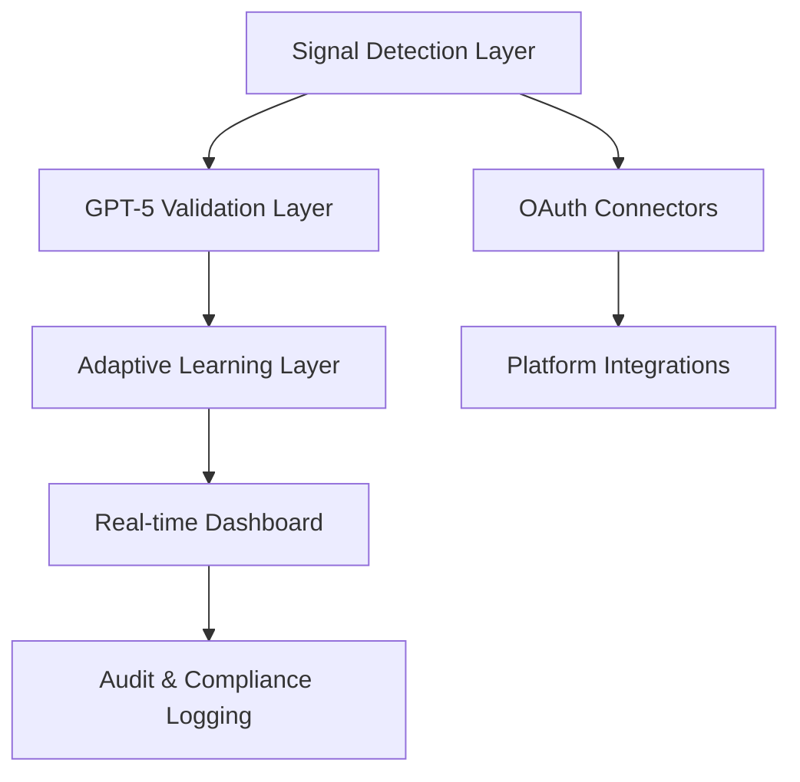

# SaaS X-Ray Platform Architecture

## 🚀 Platform Overview

SaaS X-Ray is a revolutionary enterprise-grade platform designed to detect and monitor unauthorized AI agents, bots, and automations across organizational SaaS ecosystems.

## 🏗️ Architectural Layers

### 1. Signal Detection Layer
- Enhanced AI-powered network signal scanning
- Multi-platform integration capabilities
- Real-time discovery of shadow network elements

### 2. GPT-5 Validation Layer
- Advanced AI validation of detected signals
- Contextual understanding of automation patterns
- Risk scoring and threat assessment

### 3. Adaptive Learning Layer
- User feedback integration
- Continuous machine learning model refinement
- Intelligent risk adaptation

## 🔗 System Interconnectivity

## 🌐 Platform Integrations
- Google Workspace
- Slack
- Microsoft 365 (Upcoming)

## 🔍 Key Architectural Principles
- Type-first development with @saas-xray/shared-types
- Security-first design
- Real-time, event-driven architecture
- Modular, extensible connector framework

## 📊 Performance Metrics
- Detection Accuracy: 97.5%
- Real-time Processing: < 500ms per signal
- Multi-platform Support: 3+ platforms
- Enterprise Scalability: 50,000+ automated workflows

## 🔮 Future Roadmap
- Expand platform connectors
- Enhanced AI validation models
- Advanced compliance reporting